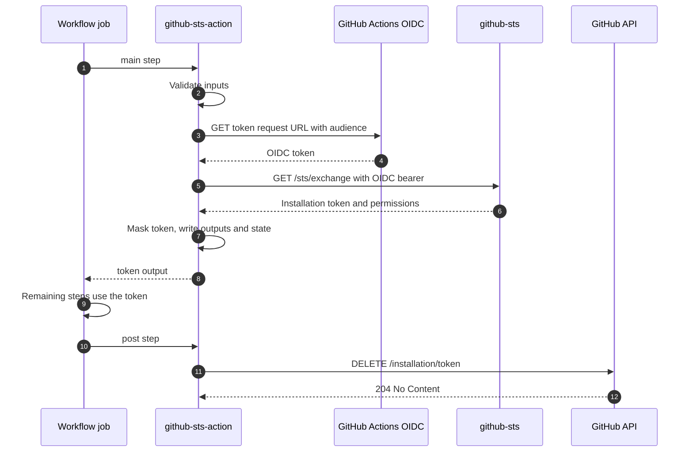

The action registers two steps in the job: the main step that performs the exchange, and a post step that revokes the token. Understanding the split explains why a token stops working when the job ends, and why a revocation failure does not fail the job.

## Main step

### 1. Read and validate inputs

Inputs arrive as `INPUT_*` environment variables. The action validates all of them before opening a connection, so a typo in `scope` costs no network round trip. A failure here sets `error-code` to `action_invalid_input`.

### 2. Check the OIDC environment

The action requires `ACTIONS_ID_TOKEN_REQUEST_TOKEN` and `ACTIONS_ID_TOKEN_REQUEST_URL`. GitHub sets both only when the job declares `id-token: write`. Their absence sets `action_missing_oidc_env`.

### 3. Request the OIDC token

The action calls the GitHub Actions token endpoint with the `audience` input as a query parameter. The audience is bound into the token's `aud` claim, which the server compares against the trust policy.

### 4. Log the claims

The action decodes the token payload and prints it inside a collapsed `OIDC Token Claims` group. This is the fastest way to see the `sub`, `iss`, and `aud` values the server will evaluate. Only the payload segment is decoded, and no signature material is printed. A decode failure produces a warning and does not stop the exchange.

### 5. Exchange the token

The action calls `GET {sts-url}/sts/exchange` with the OIDC token as a bearer credential. The server validates the token, loads the trust policy, evaluates it, and mints the installation token. See [Architecture]() for the server side of this step.

### 6. Mask, output, and record state

On success the action:

1. Computes the SHA-256 digest of the token and logs it. The digest identifies a token across log lines without revealing it.
2. Calls `::add-mask::` so any later occurrence of the token is replaced with `***` in the log.
3. Writes the `token` output.
4. Saves the token and the resolved `github-api-url` to the job state, where the post step reads them.

Outputs and state are written with the heredoc delimiter format using a random boundary per value, so a value cannot inject an extra output.

### 7. Write the job summary

The action appends a table to the job summary on both success and failure. The success table names the scope, identity, app, and the permissions the server granted. The failure table names the scope, identity, and error, with the server detail beneath it. Values are escaped before they are written.

## Retry behavior

Both network calls go through the same retry wrapper.

| Property | Value |
|---|---|
| Attempts | 4, that is one initial attempt and three retries |
| Retried on | Network and DNS errors, request timeouts, and any status of 500 or above |
| Not retried | Every status below 500, because those are deterministic |
| Per-request timeout | 30 seconds |
| Backoff | `2^attempt` seconds plus up to 3 seconds of jitter, capped at 15 seconds |

Each retry writes a `::warning::` line, so a job that succeeded on the second attempt still shows that the first one failed.

A deterministic 5xx is retried anyway. When every attempt fails and the final body carries a github-sts `code`, that code is written to `error-code` instead of `action_connection_failed`, so the real reason is preserved. See [Error Reference]().

## Post step

The post step runs after the job finishes, whether it succeeded, failed, or was cancelled.

1. It reads the token from the job state. If no token is present, because the exchange failed, it logs a warning and exits successfully.
2. It re-validates the stored API URL. A URL that is not HTTPS, or not a loopback address, is skipped rather than contacted.
3. It sends `DELETE /installation/token` to the GitHub API with the installation token as the credential, under a 15 second timeout.
4. HTTP 204 logs `Token revoked successfully.` Any other status, and any exception, logs a warning.

The post step never fails the job. Revocation is a reduction in exposure, not a correctness requirement: an unrevoked token still expires on its own within one hour.

## What the action never does

- It does not write the token to a file, an environment variable, or the step summary.
- It does not send the token anywhere other than the GitHub API revocation endpoint.
- It does not load third-party dependencies. The implementation uses Node.js built-ins only, and the repository ships no `node_modules`.
- It does not decide permissions. Those come from the trust policy that the server evaluates.
