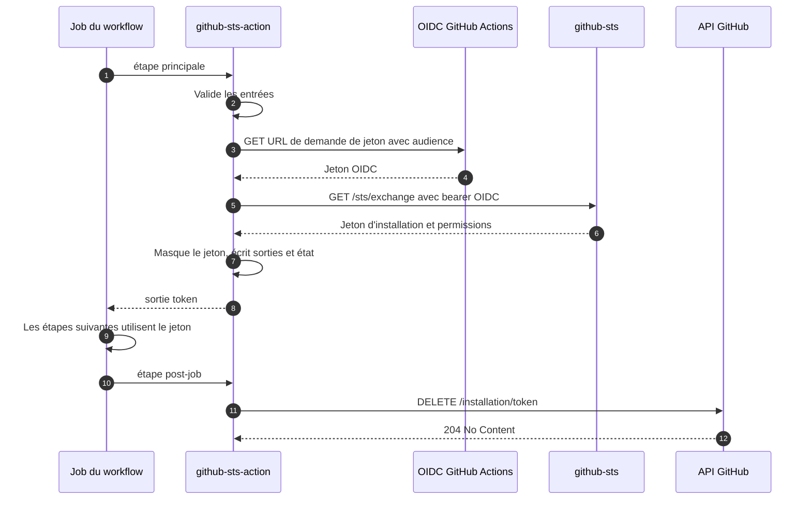

L'action enregistre deux étapes dans le job : l'étape principale qui réalise l'échange, et une étape post-job qui révoque le jeton. Comprendre cette séparation explique pourquoi un jeton cesse de fonctionner à la fin du job, et pourquoi un échec de révocation ne fait pas échouer le job.

## Étape principale

### 1. Lire et valider les entrées

Les entrées arrivent sous forme de variables d'environnement `INPUT_*`. L'action les valide toutes avant d'ouvrir une connexion, de sorte qu'une faute de frappe dans `scope` ne coûte aucun aller-retour réseau. Un échec ici définit `error-code` à `action_invalid_input`.

### 2. Vérifier l'environnement OIDC

L'action exige `ACTIONS_ID_TOKEN_REQUEST_TOKEN` et `ACTIONS_ID_TOKEN_REQUEST_URL`. GitHub ne définit ces deux variables que si le job déclare `id-token: write`. Leur absence produit `action_missing_oidc_env`.

### 3. Demander le jeton OIDC

L'action appelle le point d'entrée de jeton de GitHub Actions avec l'entrée `audience` en paramètre de requête. L'audience est liée à la claim `aud` du jeton, que le serveur compare à la politique de confiance.

### 4. Journaliser les claims

L'action décode la charge utile du jeton et l'affiche dans un groupe replié nommé `OIDC Token Claims`. C'est le moyen le plus rapide de voir les valeurs `sub`, `iss` et `aud` que le serveur va évaluer. Seul le segment de charge utile est décodé, et aucun élément de signature n'est affiché. Un échec de décodage produit un avertissement et n'interrompt pas l'échange.

### 5. Échanger le jeton

L'action appelle `GET {sts-url}/sts/exchange` avec le jeton OIDC comme identifiant bearer. Le serveur valide le jeton, charge la politique de confiance, l'évalue et émet le jeton d'installation. Voir [Architecture]() pour le côté serveur de cette étape.

### 6. Masquer, exposer et enregistrer l'état

En cas de succès, l'action :

1. Calcule l'empreinte SHA-256 du jeton et la journalise. Cette empreinte identifie un jeton d'une ligne de journal à l'autre sans le révéler.
2. Appelle `::add-mask::` afin que toute occurrence ultérieure du jeton soit remplacée par `***` dans le journal.
3. Écrit la sortie `token`.
4. Enregistre le jeton et l'URL `github-api-url` résolue dans l'état du job, où l'étape post-job les relit.

Les sorties et l'état sont écrits au format à délimiteur, avec une frontière aléatoire par valeur, de sorte qu'une valeur ne peut pas injecter de sortie supplémentaire.

### 7. Écrire le résumé du job

L'action ajoute un tableau au résumé du job, en cas de succès comme en cas d'échec. Le tableau de succès indique le scope, l'identité, l'app et les permissions accordées par le serveur. Le tableau d'échec indique le scope, l'identité et l'erreur, suivis du détail retourné par le serveur. Les valeurs sont échappées avant d'être écrites.

## Comportement des reprises

Les deux appels réseau passent par le même mécanisme de reprise.

| Propriété | Valeur |
|---|---|
| Tentatives | 4, soit une tentative initiale et trois reprises |
| Retenté pour | Erreurs réseau et DNS, délais dépassés, et tout statut supérieur ou égal à 500 |
| Non retenté | Tout statut inférieur à 500, car ces réponses sont déterministes |
| Délai par requête | 30 secondes |
| Attente | `2^tentative` secondes plus jusqu'à 3 secondes de jitter, plafonnées à 15 secondes |

Chaque reprise écrit une ligne `::warning::`, si bien qu'un job ayant réussi à la deuxième tentative montre tout de même l'échec de la première.

Un 5xx déterministe est malgré tout retenté. Lorsque toutes les tentatives échouent et que le dernier corps porte un `code` github-sts, cette valeur est écrite dans `error-code` au lieu de `action_connection_failed`, ce qui préserve la raison réelle. Voir [Référence des erreurs]().

## Étape post-job

L'étape post-job s'exécute à la fin du job, qu'il ait réussi, échoué ou été annulé.

1. Elle lit le jeton dans l'état du job. En l'absence de jeton, parce que l'échange a échoué, elle journalise un avertissement et se termine avec succès.
2. Elle valide de nouveau l'URL d'API enregistrée. Une URL qui n'est ni en HTTPS ni une adresse de bouclage est ignorée plutôt que contactée.
3. Elle envoie `DELETE /installation/token` à l'API GitHub avec le jeton d'installation comme identifiant, sous un délai de 15 secondes.
4. Un HTTP 204 journalise `Token revoked successfully.` Tout autre statut, et toute exception, journalise un avertissement.

L'étape post-job ne fait jamais échouer le job. La révocation réduit l'exposition, elle ne conditionne pas la correction : un jeton non révoqué expire de lui-même en moins d'une heure.

## Ce que l'action ne fait jamais

- Elle n'écrit pas le jeton dans un fichier, une variable d'environnement ou le résumé de l'étape.
- Elle n'envoie le jeton nulle part ailleurs qu'au point d'entrée de révocation de l'API GitHub.
- Elle ne charge aucune dépendance tierce. L'implémentation n'utilise que les modules natifs de Node.js, et le dépôt ne livre aucun `node_modules`.
- Elle ne décide pas des permissions. Celles-ci proviennent de la politique de confiance évaluée par le serveur.
